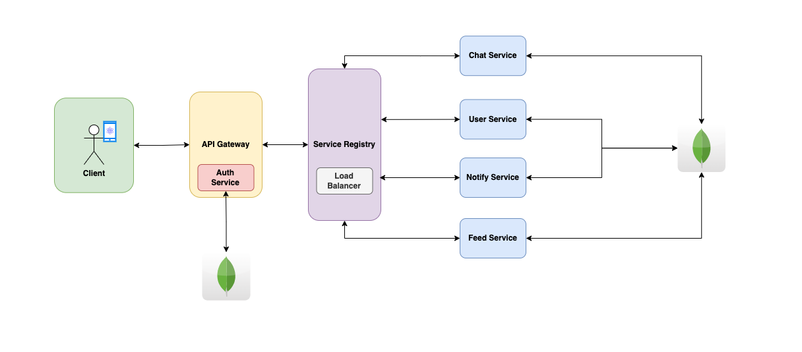

# Chamber

A scalable, social networking application

## Core Features

- <b>User profiles</b>: Users can create and edit their own profiles, which can include information such as their name, bio, and profile picture.
- <b>News feed</b>: Users can view a feed of content posted by their friends.
- <b>Posting</b>: Users can create and share their own text, photos, and videos with their friends.
- <b>Friends</b>: Users can add each other as friends, allowing them to see their posts in their news feed.
- <b>Direct messaging</b>: Users can communicate privately with other users through direct messages.

## Architecture

| Service          | Description                                                                                                                                           |
| ---------------- | ----------------------------------------------------------------------------------------------------------------------------------------------------- |
| Client App       | Frontend mobile application, built in React Native styled from scratch with vanilla stylesheets.                                                      |
| API Gateway      | Acts as a single entry point for client requests and routes them to the appropriate service. It also handles authorization, and load balancing.       |
| Service Registry | Acts as a directory of all microservices in the system, allowing other services to discover and communicate with them.                                |
| Auth Service     | Handles registration, login, and authentication of user credentials. Creates a session token for the mobile client to be included in server requests. |
| Event Service    | Manages the creation and delivery of notifications to users.                                                                                          |
| Chat Service     | In conjunction with the event service,handles real-time messaging between users.                                                                      |
| User Service     | Responsible for managing user profiles, including updates, retrieving friends lists and user search.                                                  |
| Feed Service     | Responsible for generating and delivering news feeds to users based on their relationships with other users.                                          |
| Relation Service | Manages relationships between users, including adding friends, and handling friend requests.                                                          |
